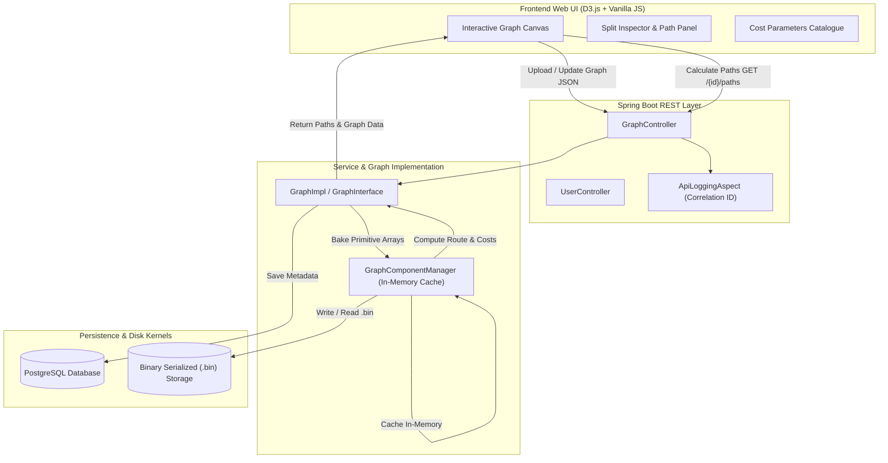
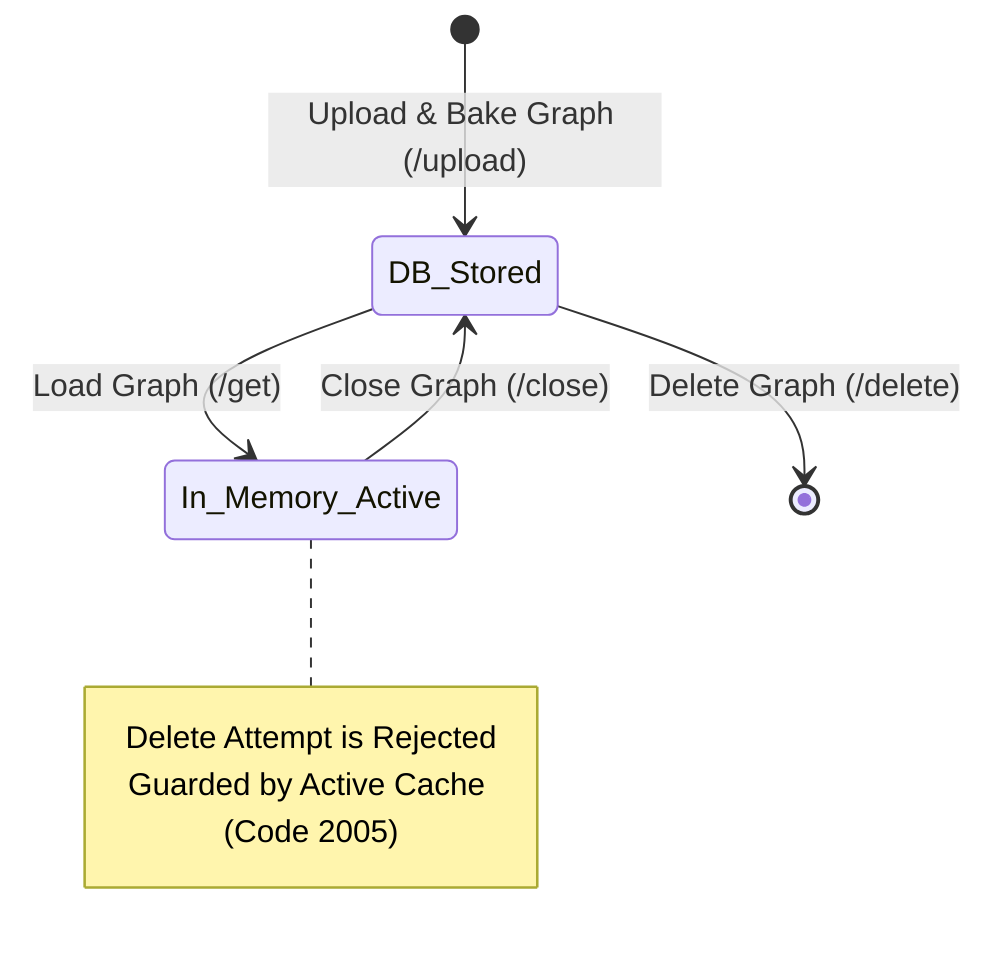

# DAG Engine — High-Performance In-Memory Graph Processing System

[](https://openjdk.org/)
[](https://spring.io/projects/spring-boot)
[](https://www.postgresql.org/)
[](https://d3js.org/)
[](https://maven.apache.org/)

---

## 🎬 UI Demo Video

> ### 🎥 [**Watch the Interactive UI Walkthrough & Demo Video**](https://your-video-link-here)
>
> [](https://your-video-link-here)
>
> *Click the link above to watch the complete end-to-end demonstration showcasing graph visualization, real-time node & edge manipulation, multi-dimensional cost parameters, and automated DAG path calculation.*

---

## 📖 Overview

**DAG Engine** is an enterprise-grade, stateful, in-memory **Directed Acyclic Graph (DAG)** processing and workflow framework built with **Java 25**, **Spring Boot**, **PostgreSQL**, and a modern **D3.js Glassmorphism Web Interface**.

Traditional graph processing frameworks in Java suffer from severe object overhead, pointer indirection, and unpredictable Garbage Collection (GC) pauses during massive traversals. **DAG Engine** solves this by "baking" JSON graph topology requests into continuous, flat **primitive arrays** (`int[]`, `double[]`) that reside directly in memory for ultra-low latency graph algorithms, path calculations, and multi-dimensional cost evaluations.

---

## ✨ Key Capabilities

### 🎨 Modern Interactive Web UI
- **Glassmorphism Design System**: Built with modern dark-mode aesthetic, vibrant cyan/blue glowing accents, micro-animations, and responsive layout.
- **Dynamic D3.js Force Simulation**: Hardware-accelerated SVG graph canvas with continuous force layouts, drag-and-drop node pinning, dynamic zoom constraints, and instant "Fit to Screen" camera transforms.
- **View Mode vs. Live Edit Mode**:
  - **View Mode**: Safe inspection of nodes, edges, connections, and multi-dimensional cost breakdowns.
  - **Edit Mode**: Real-time canvas editing with a split-view right inspector (Upper section for Node management, Lower section for Directed Edge management). Add, edit, or delete nodes and directed edges interactively.
- **Dynamic Cost Parameters Catalogue**: Expandable top-left card displaying global cost metrics (e.g., `time`, `cost`, `latency`, `bandwidth`). Add new dimensions on the fly with automatic graph-wide node and edge parameter synchronization.
- **Inline Graph Metadata Editing**: Click directly on the graph title in the header to open a modal for immediate graph name and description updates.
- **Automated Path Calculation Engine**:
  - Floating **"Calculate Paths"** trigger conveniently located at the bottom-left of the viewport (visible strictly in View Mode).
  - Right slidable panel with an independent **Paths** tab displaying all computed routes as expandable cards (`Path 1`, `Path 2`, etc.).
  - **Sequential Node & Edge Route Flow**: Expanding any path card displays the exact route taken ($$\text{Node A} \longrightarrow \text{Edge 1} \longrightarrow \text{Node B} \longrightarrow \text{Edge 2} \longrightarrow \text{Node C}$$).
  - **Independent Multi-Expansion**: Expand multiple paths simultaneously for side-by-side route and cumulative cost comparison.
  - **Interactive SVG Route Highlighting**: Hovering or expanding a path card illuminates the entire traversal on the SVG canvas with glowing halos while gently dimming unrelated topology.
- **End-to-End Correlation Tracking**: Automatic generation of 27-digit sequential correlation IDs (`yyyyMMddHHmmssSSS` + 10-digit sequence) attached to HTTP headers and query params, logged to database tables for pinpoint API debugging.

---

### ⚡ Low-Latency Backend Architecture
1. **Primitive Array Backing**: Graphs are compiled into contiguous flat primitive memory structures (`int[]`, `double[]`) based on pluggable internal representations (e.g., Adjacency Matrix, CSR).
2. **Binary Disk Serialization**: Baked topologies are persisted as raw `.bin` files on disk for sub-millisecond deserialization and cache warm-up.
3. **Active Memory Guards**: Thread-safe in-memory cache (`ConcurrentHashMap`) ensures graphs currently active in memory cannot be abruptly deleted from disk or the database (Error Code `2005`).
4. **Relational Metadata with PostgreSQL**: Stores user associations, graph attributes, cycle validation status, and raw JSON payloads for historical recovery.
5. **Pluggable Storage Architectures**: Extensible `GraphComponentManagerFactory` allows seamless switching between storage kernels (e.g., `ADJACENCY_V1`, Compressed Sparse Row).

---

## 🏛️ System Architecture

### Component Workflow



---

### Graph Lifecycle State Machine



---

## 🛠️ Technology Stack

| Layer | Technologies | Description |
| :--- | :--- | :--- |
| **Frontend** | HTML5, CSS3 Glassmorphism, Vanilla JS (ES6+) | Dependency-free, fast, custom-styled web UI |
| **Visualization** | D3.js v7, Lucide Icons | Force-directed graphs, dynamic transforms, SVGs |
| **Backend** | Java 25 (Preview Features), Spring Boot 3.4.x | High-throughput REST backend & in-memory engine |
| **Database** | PostgreSQL 16+ | Relational metadata, raw JSON payloads, API logs |
| **ORM & Data** | Spring Data JPA, Hibernate | Database entity mappings and repository operations |
| **Build & Tooling** | Maven 3.9+, Maven Wrapper (`mvnw`) | Build automation, testing, and lifecycle management |

---

## 🚀 End-to-End REST API Reference

All endpoints are hosted under `/workflow-engine` and support automated correlation tracking via `X-Correlation-ID` header and `?correlationId=...` query parameters.

### 👤 User Management
| Method | Endpoint | Description |
| :--- | :--- | :--- |
| `POST` | `/workflow-engine/user/create` | Register a new user (`userName`, `userPassword`). |
| `POST` | `/workflow-engine/user/validate` | Authenticate user credentials. |
| `POST` | `/workflow-engine/user/get` | Retrieve user profile along with their full graph catalogue. |
| `POST` | `/workflow-engine/user/delete` | Delete user and their associated graph resources. |

### 🕸️ Graph Lifecycle & Operations
| Method | Endpoint | Description |
| :--- | :--- | :--- |
| `POST` | `/workflow-engine/graphs/upload` | Upload a new JSON graph DAG, validate acyclicity, and bake to disk. |
| `POST` | `/workflow-engine/graphs/get` | Load a graph into in-memory cache and return UI-ready payload. |
| `POST` | `/workflow-engine/graphs/update` | Update graph structure (`C`: Complex) or metadata (`S`: Simple). |
| `POST` | `/workflow-engine/graphs/close` | Evict graph from in-memory cache to reclaim JVM heap memory. |
| `POST` | `/workflow-engine/graphs/delete` | Safely remove graph from DB and disk (fails if graph is active). |

### 🧭 Path Calculation
| Method | Endpoint | Description |
| :--- | :--- | :--- |
| `GET` | `/workflow-engine/graphs/{graphId}/paths` | Calculates all valid routes from start to terminal nodes with cumulative costs. |
| `POST` | `/workflow-engine/graphs/paths` | Calculate paths by providing explicit `GraphMetaData`. |

#### Sample Path Response:
```json
{
  "graphId": 24,
  "graphName": "Multi Path Test DAG",
  "totalPaths": 2,
  "paths": [
    {
      "nodeSequence": [
        { "id": 1, "name": "Source Node" },
        { "id": 3, "name": "Route Beta" },
        { "id": 4, "name": "Destination Node" }
      ],
      "pathCosts": { "time": 9.0, "cost": 68.0 }
    },
    {
      "nodeSequence": [
        { "id": 1, "name": "Source Node" },
        { "id": 2, "name": "Route Alpha" },
        { "id": 4, "name": "Destination Node" }
      ],
      "pathCosts": { "time": 14.0, "cost": 62.0 }
    }
  ],
  "objErrorDetails": { "errorCode": "0", "errorMessage": "SUCCESS" }
}
```

---

## 💻 Getting Started

### Prerequisites
- **JDK 25** (with preview features enabled)
- **PostgreSQL 15+** installed and running
- **Git**

### Database Setup
Create the PostgreSQL database and configure your connection:
```sql
CREATE DATABASE dag_engine_db;
```

Update your credentials in `src/main/resources/application.properties`:
```properties
spring.datasource.url=jdbc:postgresql://localhost:5432/dag_engine_db
spring.datasource.username=postgres
spring.datasource.password=your_password
spring.jpa.hibernate.ddl-auto=update
```

### Running Locally

1. **Clone the repository**:
   ```bash
   git clone https://github.com/adityakumar565/Project-Nexus.git
   cd Project-Nexus
   ```

2. **Start the Spring Boot application**:
   - **On Windows**:
     ```powershell
     .\mvnw.cmd spring-boot:run
     ```
   - **On Linux / macOS**:
     ```bash
     ./mvnw spring-boot:run
     ```

3. **Open the Web Application**:
   Navigate to [**http://localhost:8091**](http://localhost:8091) in your modern browser.

---

## 🧪 Testing

Execute the comprehensive end-to-end integration and unit test suite:
```bash
./mvnw test
```

The test suite validates:
- Complete user registration and session lifecycle.
- Graph upload, acyclicity validation, and binary serialization.
- Cache hit vs. cache miss performance verification.
- Active memory deletion rejection guards (Error Code `2005`).
- Multi-dimensional pathfinding and cost summation accuracy.

---

## 📁 Repository Structure

```
dag-engine/
├── src/
│   ├── main/
│   │   ├── java/com/workflow/dag_engine/
│   │   │   ├── aop/                 # API Logging Aspect & Correlation ID
│   │   │   ├── componentManager/    # In-memory graph cache & storage factory
│   │   │   ├── config/              # Spring application & Swagger configurations
│   │   │   ├── controller/          # REST Controllers (User, Graph)
│   │   │   ├── impl/                # Core domain and service implementations
│   │   │   ├── interfaces/          # Service and kernel contracts
│   │   │   ├── models/              # DTOs, Entities, Path representations
│   │   │   └── persistence/         # JPA Repositories
│   │   └── resources/
│   │       ├── application.properties
│   │       └── static/              # Interactive UI Web Assets
│   │           ├── app.js           # Client-side state, D3 graph, & path logic
│   │           ├── index.html       # Single-page application markup
│   │           └── styles.css       # Glassmorphism design system & micro-animations
│   └── test/java/                   # Integration and unit tests
├── graph_representation/            # Serialized binary graph storage (.bin)
├── path_representation/             # Serialized path compute representations
├── pom.xml                          # Maven build definition
└── README.md                        # Documentation
```

---

## 📄 License

This project is licensed under the Apache-2.0 License.
