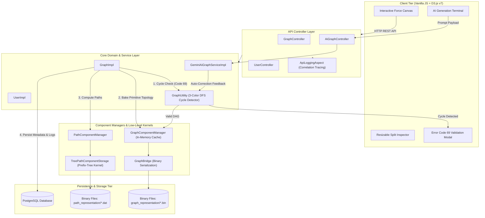

# DAG Engine — High-Performance In-Memory Workflow & Graph Processing System

[](https://openjdk.org/)
[](https://spring.io/projects/spring-boot)
[](https://www.postgresql.org/)
[](https://deepmind.google/technologies/gemini/)
[](https://d3js.org/)
[](http://localhost:8091/swagger-ui/index.html)

---

## 🎬 Live Interactive UI & Demo

> ### 🎥 [**Watch the Interactive UI Walkthrough & Demo Video**](https://your-video-link-here)
>
> [](https://your-video-link-here)
>
> *Watch the end-to-end walkthrough showcasing AI prompt-to-graph synthesis, live canvas manipulation, cycle validation (Error Code 69), multi-dimensional cost routing, and automated prefix-tree path calculation.*

---

## 📖 Overview

**DAG Engine** is an enterprise-grade, stateful, in-memory **Directed Acyclic Graph (DAG)** workflow and execution framework. Built with **Java 25**, **Spring Boot**, **PostgreSQL**, **Google Gemini AI**, and a modern **D3.js Glassmorphism Web Interface**, it models complex task pipelines, route optimization, and cost-aware execution.

### The Problem It Solves
Traditional Java graph libraries rely on deeply nested object graphs (`Map<Node, List<Edge>>`) that suffer from severe memory footprint overhead, cache misses, pointer indirection, and Garbage Collection (GC) pauses during massive traversals. Furthermore, uncontrolled cyclic graphs in recursive path explorers cause infinite traversal loops, resulting in immediate JVM `OutOfMemoryError: Java heap space` crashes.

**DAG Engine** solves this by:
1. **Compiling Topologies into Primitive Arrays**: Topologies are baked into contiguous flat arrays (`int[]`, `float[]`), eliminating object bloat and maximizing CPU cache locality.
2. **Prefix-Tree Path Storage**: Paths from root to terminal nodes are calculated once and indexed via an array-backed prefix tree kernel.
3. **Rigorous Cycle Detection & Memory Defense**: An $O(V + E)$ 3-color DFS cycle detector intercepts cycles *before* storage or traversal, safeguarding the heap and returning standardized **Error Code 69** validation payloads.
4. **Natural Language AI Graph Synthesis**: Built-in Gemini AI integration that turns plain English workflow prompts into fully validated, multi-dimensional DAGs with automatic validation self-correction loops.

---

## ✨ Key Engineering Highlights

### 🤖 1. AI-Powered Prompt-to-Graph Generation & Self-Correction Loop
- **Natural Language Synthesis**: Enter any real-world workflow prompt (e.g. *"Design a CI/CD pipeline with build, test, staging, and deployment with time and failure risk costs"*).
- **Self-Correction Engine**: If Gemini generates a schema that fails the engine's internal validation rules, the engine catches the exception and feeds the error trace back to Gemini in an automated reflection loop to self-repair the topology before saving.
- **Dedicated Terminal Modal**: Embedded dark-mode purple glassmorphism prompt window with live animated progress states.

### 🛡️ 2. DAG Cycle Detection & Heap Memory Protection (Error Code `69`)
- **3-Color Depth-First Search (DFS)**: Classifies nodes into `UNVISITED (0)`, `VISITING (1)`, and `VISITED (2)` to detect back-edges, circular dependencies, self-loops, and multi-component cycles in $O(V + E)$ time.
- **Zero Heap Exhaustion**: Intercepts cycles before executing the recursive path explorer, completely eliminating runaway recursion and `OutOfMemoryError: Java heap space`.
- **Standardized Error Code 69**: Custom validation code returned to the client whenever DAG invariants are violated.
- **Interactive UI Validation Modal**: Triggers a dedicated glassmorphism popup displaying the cycle error, Error Code 69 badge, and step-by-step guidance on breaking the circular loop.

### 🧭 3. Sub-Millisecond Path Optimization Engine
- **Prefix-Tree Traversal Kernel**: Pre-computes and indexes all valid paths from source to terminal (sink) nodes into a primitive-array-backed tree structure (`TreePathComponentStorage`).
- **Multi-Dimensional Cost Evaluation**: Calculates cumulative costs across arbitrary concurrent dimensions (`time`, `cost`, `latency`, `impact`, etc.).
- **Visual Path Highlighting**: Clicking any computed route illuminates the exact sequence of nodes and edges on the D3.js canvas with glowing neon halos while gently dimming unrelated topology.

### 🎨 4. Modern Glassmorphism Web Interface
- **D3.js v7 Canvas**: Hardware-accelerated SVG force simulation with zoom/pan constraints, drag-and-drop node pinning, and auto-centering "Fit to Screen".
- **Resizable Inspector Side Panel**: Drag handle with custom width adjustments, double-click reset, toggle button, and `localStorage` persistence.
- **Dynamic Cost Parameters Catalogue**: Dedicated section in the side panel to add or delete global cost dimensions on the fly with circular SVG action controls and horizontal overflow safety.
- **End-to-End Tracing**: 27-digit sequential correlation IDs (`yyyyMMddHHmmssSSS` + 10-digit sequence) attached to every request and persisted to `logs.api_logs` for deep observability.

---

## 🏛️ System Architecture



---

## 🛠️ Technology Stack

| Layer | Technologies | Role & Purpose |
| :--- | :--- | :--- |
| **Backend Framework** | **Java 25**, **Spring Boot 4.1.0** | Modern, high-throughput JVM REST backend with virtual thread capability |
| **AI Integration** | **Google Gemini 2.5 Flash API** | Natural language workflow generation and self-correcting schema repair |
| **Database & ORM** | **PostgreSQL 16+**, **Hibernate / JPA** | Relational metadata, raw graph JSONs, user profiles, and correlation API logs |
| **Visualization** | **D3.js v7**, **Lucide Icons** | Dynamic force-directed SVG graphs, interactive zoom/pan, glowing path routes |
| **Styling & UI** | **Vanilla CSS3 Glassmorphism** | Ultra-responsive dark theme with blur filters, CSS animations, zero CSS bloat |
| **API Docs** | **OpenAPI 3.0 / Swagger UI** | Interactive, live API documentation and schema explorer |
| **Build & Tooling** | **Maven 3.9+**, **Maven Wrapper (`mvnw`)** | Reproducible builds, dependency management, and automated test runners |

---

## 🚀 REST API Reference

Interactive Swagger documentation is available at [**http://localhost:8091/swagger-ui/index.html**](http://localhost:8091/swagger-ui/index.html).

### 🤖 AI Graph Generation
| Method | Endpoint | Description |
| :--- | :--- | :--- |
| `POST` | `/workflow-engine/ai/generate` | Generates a validated DAG from a natural language prompt with self-correction. |

### 🕸️ Graph Management & Lifecycle
| Method | Endpoint | Description |
| :--- | :--- | :--- |
| `POST` | `/workflow-engine/graphs/upload` | Validates DAG acyclicity, compiles topology, and stores in PostgreSQL & disk. |
| `POST` | `/workflow-engine/graphs/update` | Updates metadata (`S`) or recalculates topology (`C`) with cycle detection (Code 69). |
| `POST` | `/workflow-engine/graphs/get` | Loads graph into active in-memory cache and returns full visualization payload. |
| `POST` | `/workflow-engine/graphs/close` | Evicts graph from active in-memory cache to reclaim JVM heap. |
| `POST` | `/workflow-engine/graphs/delete` | Removes graph from DB and disk (guarded against deleting active in-memory graphs). |

### 🧭 Path & Cost Routing
| Method | Endpoint | Description |
| :--- | :--- | :--- |
| `POST` | `/workflow-engine/graphs/paths` | Calculates all valid terminal routes with cumulative multi-dimensional costs. |
| `GET` | `/workflow-engine/graphs/{id}/paths`| Quick route calculation for a specific graph by ID. |

### 👤 User Management
| Method | Endpoint | Description |
| :--- | :--- | :--- |
| `POST` | `/workflow-engine/user/create` | Register a new user profile. |
| `POST` | `/workflow-engine/user/validate` | Authenticate user credentials. |
| `POST` | `/workflow-engine/user/get` | Fetch user profile along with their full graph catalogue. |
| `POST` | `/workflow-engine/user/delete` | Delete user and cascade cleanup of associated graphs. |

---

## 🧪 Testing & Validation

Execute the unit and integration test suite:
```bash
./mvnw test
```

### Verified Test Cases:
- **`GraphUtilityTest`**: Validates linear DAGs, diamond DAGs, self-loops, 2-node cycles, multi-node loops, and disconnected cyclic graphs.
- **`CorrelationIdGeneratorTest`**: Verifies 27-digit chronological timestamp + sequence uniqueness.
- **Active Memory Guard**: Ensures active in-memory graphs cannot be prematurely deleted from storage.
- **Path Tree Correctness**: Ensures path cost summation exactly matches manual matrix verification.

---

## 💻 Getting Started Locally

### Prerequisites
- **JDK 25** (with preview features enabled)
- **PostgreSQL 16+**
- **Git**

### 1. Database Setup
```sql
CREATE DATABASE dag_nexus_db;
```

### 2. Configure Environment
Copy the example environment template:
```bash
cp .env.example .env
```
Or configure your private API keys in `src/main/resources/application-local.properties` (automatically ignored by Git).

### 3. Run the Server
- **On Windows (PowerShell)**:
  ```powershell
  .\mvnw.cmd spring-boot:run
  ```
- **On Linux / macOS**:
  ```bash
  ./mvnw spring-boot:run
  ```

### 4. Access the Application
Open [**http://localhost:8091**](http://localhost:8091) in your browser. Default test credentials:
- **Username**: `Aditya`
- **Password**: `Kumar`

---

## 🗺️ Upcoming Roadmap (Next Sprints)

1. **Cost-Cutoff Traversal Engine**:
   - Introduce a new pluggable `PathCutoffComponentManager` and `PathCutoffUtilityImpl`.
   - Support cyclic workflows bounded by budget/cutoff thresholds (cycles naturally terminate once cumulative cost exceeds the budget).
2. **Role-Based Access Control (RBAC)**:
   - Introduce user roles (`ADMIN`, `OPERATOR`, `VIEWER`).
   - Secure REST endpoints using Spring Security `@PreAuthorize` and adapt UI controls dynamically based on user privileges.
3. **Containerization & CI/CD Pipeline**:
   - Multi-stage Docker image and `docker-compose.yml` for zero-install evaluation.
   - GitHub Actions workflow for automated PR testing and security scanning.

---

## 📄 License
This project is licensed under the Apache-2.0 License.
