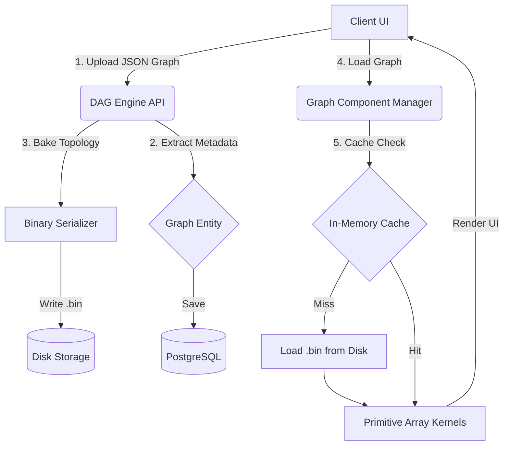
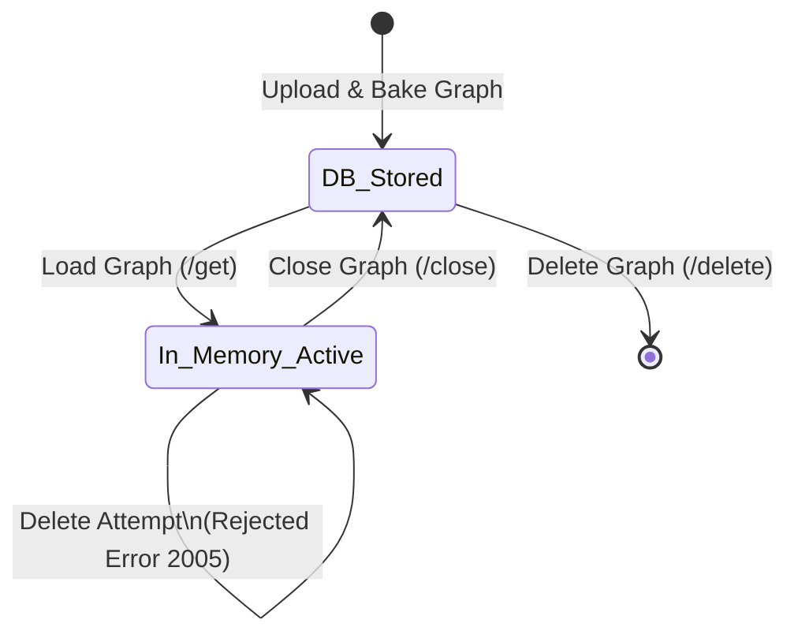

# DAG Engine

DAG Engine is a highly optimized, stateful, in-memory Directed Acyclic Graph (DAG) processing framework built with **Java 25**, **Spring Boot**, and **PostgreSQL**. 

It is designed to efficiently store, load, and manage complex graphs by converting JSON-based graph topology requests into heavily optimized primitive arrays representations that remain active in memory for rapid graph traversal, pathfinding, and computational algorithms.

## Core Architecture

DAG Engine employs a persistent backing store (PostgreSQL) alongside an intelligent, thread-safe in-memory caching layer. To circumvent Java object overhead and Garbage Collection (GC) pauses during massive graph traversals, graphs are "baked" into primitive arrays (`int[]`, `double[]`) based on a pluggable storage format (e.g., Adjacency Matrix, CSR).

### Component Workflow



### Graph Lifecycle Management

The lifecycle of a graph within the system ensures that memory is strictly managed while preventing data corruption via active deletion guards.



## Key Features

1. **Primitive Array Backing**: Graphs are stored in continuous primitive arrays (e.g., `edgeCost[source][target][cost_dimension]`) instead of Java Objects, ensuring spatial locality and minimal memory footprints.
2. **Pluggable Implementations**: Dynamic resolution of graph internal storage via `GraphComponentManagerFactory`. Current implementations:
   - `ADJACENCY_V1`: Adjacency Matrix implementation.
   - *Extensible design for CSR, Edge Lists, etc.*
3. **Binary Serialization**: Baked graphs are serialized to raw `.bin` files via `ObjectOutputStream` for near-instantaneous deserialization upon active load.
4. **Active Memory Guards**: Thread-safe caching mechanism (`ConcurrentHashMap`) ensures that graphs currently loaded into memory cannot be abruptly deleted from the DB or disk, protecting active computational processes.
5. **Relational Metadata**: PostgreSQL stores user associations, cyclic status, node/edge counts, cost dimensions, and the raw JSON payload for robust querying.

## Technology Stack

- **Java**: 25 (Preview features enabled)
- **Framework**: Spring Boot 3.4.x
- **Database**: PostgreSQL
- **ORM**: Spring Data JPA / Hibernate
- **Build Tool**: Maven

## End-to-End API Flow

The engine provides a complete CRUD and lifecycle REST API for users and graphs.

### 1. User Management
- `POST /workflow-engine/user/create` - Register a new user.
- `POST /workflow-engine/user/delete` - Cleanly delete a user and their artifacts.

### 2. Graph Management & Lifecycle
- `POST /workflow-engine/graphs/upload`: Uploads the DAG JSON. The system bakes the topology into a primitive structure, writes it to disk as a `.bin`, and saves metadata to PostgreSQL.
- `POST /workflow-engine/graphs/get`: Loads the graph into active memory (or hits the cache) and returns the full JSON representation back to the client for canvas rendering.
- `POST /workflow-engine/graphs/close`: Unloads the active graph from memory, deregistering it from the `GraphComponentManager` and allowing GC to reclaim primitive arrays.
- `POST /workflow-engine/graphs/delete`: Safely deletes the graph's `.bin` file and database record. ***Note**: This will throw an exception (Code `2005`) if the graph is currently active in memory.*

## How to Run

### Prerequisites
- JDK 25
- PostgreSQL Server running locally or remotely (configured in `application.properties`)

### Setup
1. Clone the repository.
2. Ensure PostgreSQL credentials in `src/main/resources/application.properties` are correct.
3. Run the application:

```bash
./mvnw.cmd spring-boot:run
```

### Running Tests
An extensive end-to-end integration suite is provided in `UserJourneyIntegrationTest` which validates the entire user and graph lifecycle (Create User -> Upload -> Load -> Cache Hit -> Invalid Delete -> Close -> Delete Graph -> Delete User).

```bash
./mvnw.cmd test
```

## Code Organization

- `models/`: DTOs, Entities, Request/Response shapes.
- `controller/`: REST endpoints handling the web layer.
- `persistence/`: JPA Repositories and Hibernate entities.
- `impl/`: Core service logic orchestrating workflows.
- `componentManager/graphs/`: The intelligent memory and computational layer containing the Bridge interfaces, Kernel implementations, and `ComponentManagerFactory`.
